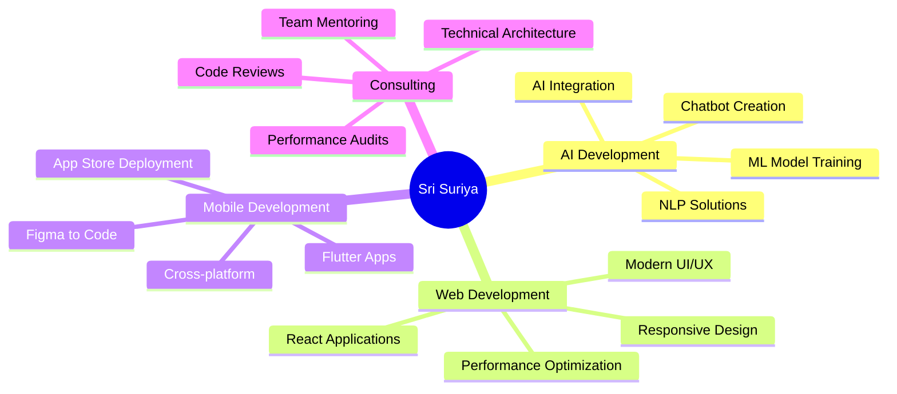

# Hi there! 👋 I'm **Sri Suriya S**

<div align="center">
  
  <!-- Animated Typing Header -->
  
  
  <!-- Professional Banner -->
  
  
</div>

---

## 👨‍💻 **About Me**


```typescript
interface Developer {
  name: string;
  role: string;
  location: string;
  expertise: string[];
  currentFocus: string;
  availableForHire: boolean;
}

const sriSuriya: Developer = {
  name: "Sri Suriya S",
  role: "Freelancing AI Developer",
  location: "Tamil Nadu, India 🇮🇳",
  expertise: [
    "AI & Machine Learning",
    "Frontend Development", 
    "Mobile App Development",
    "UI/UX Design"
  ],
  currentFocus: "Building intelligent solutions with AI",
  availableForHire: true
};
```

### 🎯 **What I Do**
- 🤖 **AI Development**: Creating intelligent chatbots and ML models
- 🌐 **Web Development**: Building responsive, modern web applications  
- 📱 **Mobile Development**: Flutter apps from Figma designs
- 🎨 **UI/UX Design**: Crafting beautiful, user-centered interfaces

---

## 🛠️ **Technology Stack**

<details>
<summary><b>🔧 Click to expand my tech arsenal</b></summary>
<br>

### **Languages**
<p>
  
  
  
  
  
  
</p>

### **Frameworks & Libraries**
<p>
  
  
  
  
  
  
</p>

### **Tools & Platforms**
<p>
  
  
  
  
</p>

### **AI & ML**
<p>
  
  
  
  
</p>

</details>

---

## 📊 **GitHub Analytics**

<div align="center">
  
  <!-- GitHub Stats Cards -->
  
  
  
</div>

<div align="center">
  
  <!-- Language Stats & Trophies -->
  
  
  
</div>

---

## 🚀 **Featured Projects**

<div align="center">

| Project | Description | Tech Stack | Links |
|---------|-------------|------------|-------|
| 🤖 **AI Chatbot Engine** | Intelligent conversational AI with NLP capabilities | `Python` `TensorFlow` `OpenAI API` | [](https://github.com/srisuriya13022006) [](https://srisuriya.github.io) |
| 🌐 **Modern Web Dashboard** | Responsive admin dashboard with real-time analytics | `React` `TypeScript` `Node.js` | [](https://github.com/srisuriya13022006) [](https://srisuriya.github.io) |
| 📱 **Flutter Mobile Suite** | Cross-platform mobile apps from Figma designs | `Flutter` `Dart` `Firebase` | [](https://github.com/srisuriya13022006) [](https://srisuriya.github.io) |
| 🎨 **Design System Library** | Reusable UI components and design tokens | `Figma` `React` `Storybook` | [](https://github.com/srisuriya13022006) [](https://srisuriya.github.io) |

</div>

---

## 📈 **Development Activity**

<div align="center">
  
  <!-- Contribution Graph -->
  
  
  <!-- Snake Animation -->
<!-- Snake Animation -->
<picture>
  <source media="(prefers-color-scheme: dark)" srcset="https://raw.githubusercontent.com/srisuriya13022006/srisuriya13022006/output/github-contribution-grid-snake-dark.svg">
  <source media="(prefers-color-scheme: light)" srcset="https://raw.githubusercontent.com/srisuriya13022006/srisuriya13022006/output/github-contribution-grid-snake-light.svg">
  
</picture>
  
</div>

---

## 💼 **Services & Expertise**

<div align="center">



</div>

---

## 🌐 **Let's Connect & Collaborate**

<div align="center">
  
  <!-- Contact Badges -->
  [](https://srisuriya.github.io)
  [](mailto:srisuriya200602@gmail.com)
  [](https://github.com/srisuriya13022006)
  
  <br><br>
  
  <!-- Professional Quote -->
  
  
  <br><br>
  
  <!-- Status Indicators -->
  
  
  
  
</div>

---

<div align="center">
  
  ### 💡 *"Transforming ideas into intelligent digital solutions"*
  
  **🚀 Available for freelance projects • Open to collaboration • Always learning**
  
  
  
</div>
